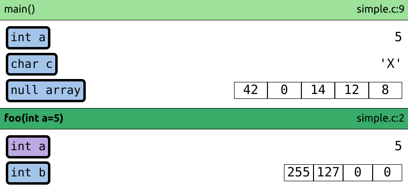
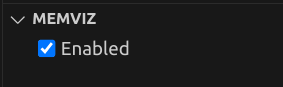
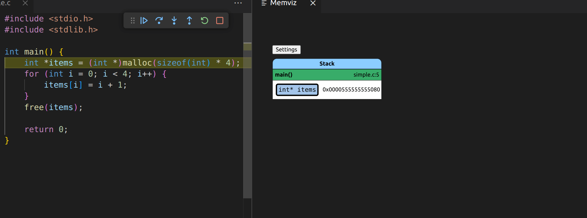

# Memory visualizer

This extension is designed to visualize the address space of (primarily C) programs.
It has been created as an education tool for the [Introduction to Programming](https://github.com/geordi/upr-course) at VSB-TUO, but it can be used as a general visualization tool.

> The extension is currently only compatible with x64 Linux programs and the GDB debugger.
> It requires GDB 12.1 or newer!



## How to use

Simply start a normal debugging session of a _C_ file (using e.g. `F5`) using the `GDB` debugger.
`Memviz` will then open a webview that will visualize the state of the program once it stops on a breakpoint.

> You have to compile your program with debug symbols (e.g. `gcc -g`) for the visualization (and debugging itself) to work!

The visualized components are interactive. You can e.g. expand/collapse stack frames, displays byte values of scalar
values or change the start index of array elements that are displayed.

You can also pan the canvas using the middle mouse button and zoom using the mouse wheel.

### Configuration

When you open the `Run and Debug` container in the Activity Bar on the left, you should see a foldable section title `Memviz`, which can be used to configure Memviz. Currently, the only thing that can be configured is if `Memviz` is enabled or not. If Memviz causes any issues during debugging, you can temporarily turn it off here without uninstalling the plugin.



## Features

- Memory visualization
  - Stack frames
  - Scalars (integers, floats, chars)
  - Arrays
  - Pointers
  - Strings (both inline char arrays and string pointers)
- Heap allocation visualization
  - Visualization of heap allocations based on data type of pointers pointing to them
  - `malloc`/`free` tracking using GDB
  - Highlighting of released heap allocations
- Lazy loading of memory from the debugged process
- Simple tracking of variable initialization
  - Note that the initialization tracking is offset by one line, i.e. the variable is assumed to be initialized on the line where it is declared.

## Planned/WIP features

- Structs
- Dark/light mode that reacts to VSCode theme
- Enums

## Unsupported features

- Multiple threads
- Bitfields

## Examples

- Heap memory tracking

  

## Development

1. Install dependencies:
   ```bash
   $ npm install
   ```
2. Open the project in Visual Studio code and start debugging (F5) to test the extension.
