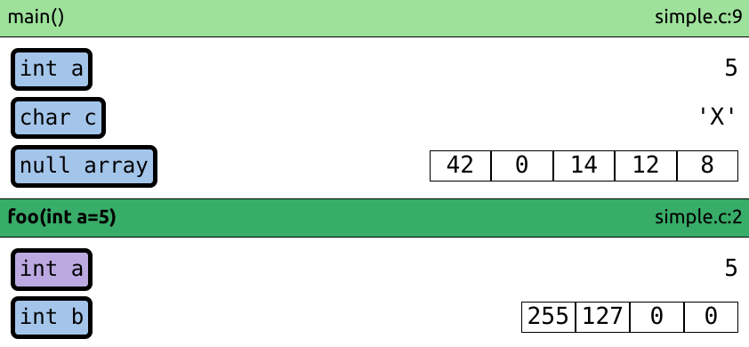
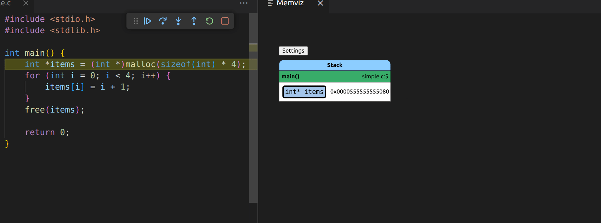

# Memory visualizer

This extension is designed to visualize the address space of C and Python programs.
It has been created as an education tool for the [Introduction to Programming](https://github.com/geordi/upr-course) at VSB-TUO, but it can be used as a general visualization tool.



## Requirements and compatibility
### C
> The extension is currently only compatible with x64 Linux programs and the GDB debugger.
> It requires GDB 12.1 or newer!

> You have to compile your program with debug symbols (e.g. `gcc -g`) for the visualization (and debugging itself) to work!

### Python
> Compatible with **Python 3.10** or newer. 
> Works using the standard VS Code Python debugger (`debugpy`).

## How to use

Simply start a normal debugging session of a _C_ or _Python_ file (using e.g. `F5`).
`Memviz` will then open a webview that will visualize the state of the program once it stops on a breakpoint.

The visualized components are interactive. You can e.g. expand/collapse stack frames, displays byte values of scalar
values or change the start index of array elements that are displayed.

You can also pan the canvas using the middle mouse button and zoom using the mouse wheel.

### Configuration

When you open the `Run and Debug` container in the Activity Bar on the left, you should see a foldable section title `Memviz`, which can be used to configure Memviz. Currently, the only thing that can be configured is if `Memviz` is enabled or not. If Memviz causes any issues during debugging, you can temporarily turn it off here without uninstalling the plugin.


## Features
### C-specific features
- Memory visualization
  - Stack frames
  - Scalars (integers, floats, chars)
  - Arrays
  - Pointers
  - Strings (both inline char arrays and string pointers)
  - Structures
  - Enums
- Heap allocation visualization
  - Visualization of heap allocations based on data type of pointers pointing to them
  - `malloc`/`free` tracking using GDB
  - Highlighting of released heap allocations
- Lazy loading of memory from the debugged process
- Simple tracking of variable initialization
  - Note that the initialization tracking is offset by one line, i.e. the variable is assumed to be initialized on the line where it is declared.

### Python-specific features
- Type Support
  - Scalars (int, float, bool, None)
  - Collections (list, tuple, dict, set, frozenset)
  - Class instances and their attributes
  - Strings
- Initially shows only two levels on nested values
- Lazy loading for collections, strings and class instances
- Interactive References
  - Collections and class instances are shown as detached nodes with reference arrows
  - Hovering over an object highlights all its references
  - Clicking the source of a reference automatically highlights and jumps to the target object

## Planned/WIP features

- Dark/light mode that reacts to VSCode theme

## Unsupported features and limitations

- Multiple threads
- C Bitfields
- Very large Python stack frames (with hundreds of variables) might hit communication limit resulting with an error


## Examples

- Heap memory tracking

  

## Development

1. Install dependencies:
   ```bash
   $ npm install
   ```
2. Open the project in Visual Studio code and start debugging (F5) to test the extension.
