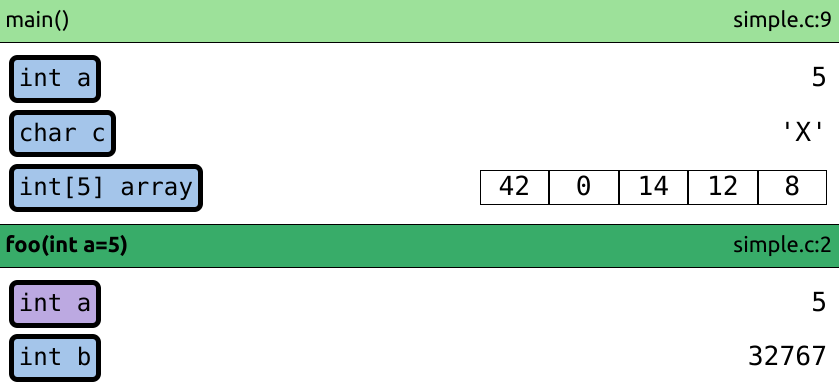

# Memory visualizer

This extension is designed to visualize the address space of (primarily C) programs.
It has been created as an education tool for the [Introduction to Programming](https://github.com/geordi/upr-course) at VSB-TUO, but it can be used as a general visualization tool.

> The extension is currently only compatible with x64 Linux programs and the GDB debugger.



## Features
- Stack trace visualization
- Heap memory allocation tracking
- Lazy loading of memory from the debugged process

## Planned/WIP features
- Visualization of pointers
- Visualization of structs
- Visualization of arrays
- Visualization of heap memory

## Unsupported features
- Multiple threads
- Bitfields
- Enums

## Development
1) Install dependencies:
    ```bash
    $ npm install
    ```
2) Open the project in Visual Studio code and start debugging (F5) to test the extension.
